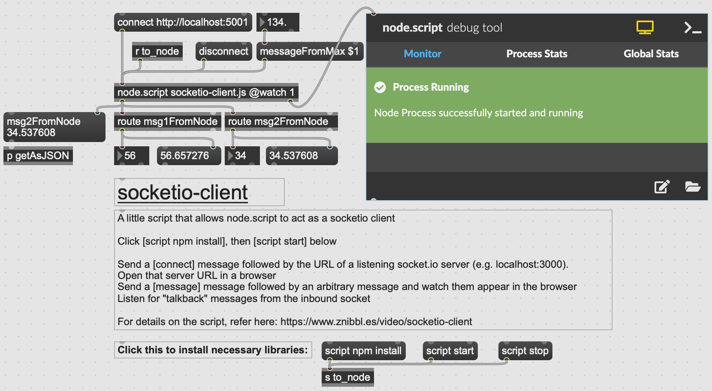

# Max + Node.js + Socket.IO + MQTT

## 1_NodeToMax-MaxToNode

In this example, we develop a communication system between [Node.js](https://nodejs.org/en/) and [Max](https://cycling74.com/products/max) using [sockets](https://socket.io/).

To run this project, start the NodeJS server:

```jsx
cd <NodeJS-folder>
npm install
npm start
```

The code will execute a server on the [localhost](http://localhost) and port 5001. There are two variables with randomly generated numbers every 3 seconds. These are sent to Max, where they are extracted using the same topic name (i.e. **msg1FromNode**).

In Max, we open the file **socketio-client.maxpat**. From here, we need to execute

- **script npm install**
- **script npm start**
- and click to **“connect http://localhost:5001”**.

If successful, we will be able to see the random numbers coming out of the **route** objects. Finally, we can send a message from Max to Node by controlling the number connected to the **messageFromMax $1**.



## 2_NodeMaxMQTT

This example extends the previous one by adding [MQTT](https://www.npmjs.com/package/mqtt) functionality to the Node.js server.

Follow the same install instructions as in the previous example. To use your own MQTT server, you need to add your MQTT broker URL (in this case [HiveMQ](https://www.hivemq.com/) is used), together with your username and password. If set correctly, you will be able to receive in Max messages from an MQTT broker (on a chosen topic), and also to send data from Max to an MQTT broker as well.

```jsx
//MQTT settings
  const clientMQTTID = Math.random().toString(16).slice(3);
  const options = {
    username: '{replace here}',
    password: '{replace here}',
    clientMQTT: clientMQTTID
  };

  //Connect to a HiveMQ Cluster. Insert your own host name and port
  const clientMQTT = mqtt.connect('tls://{replace here}.s1.eu.hivemq.cloud:8883', options);
  //Topics for MQTT
  const inTopic = "/inTopic/";
  const outTopic = "/outTopic/";
```
